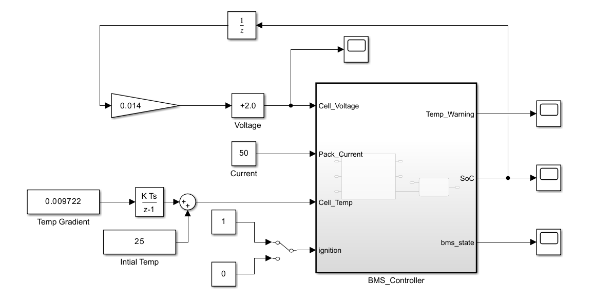
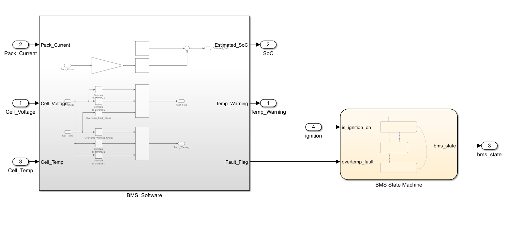

# BMS-Simulink-ECU

# Automotive Battery Management System (BMS) ECU Model

Model-Based Development (MBD) implementation of an Electric Vehicle BMS software controller in MATLAB/Simulink, featuring Stateflow state control, Coulomb Counting State-of-Charge (SoC) estimation, thermal management, multi-variable fault protection, and MISRA-compliant C code generation.

## 📌 Project Overview
* **Architecture:** Closed-loop SIL (Software-in-the-Loop) architecture separating discrete ECU software algorithms from physical plant stimuli.
* **SoC Estimation:** Discrete Coulomb Counting algorithm with rate transition handling ($T_s = 0.1\text{ s}$).
* **State Machine:** 3-state Stateflow logic (`Standby`, `Drive`, `Fault`) handling system transitions and emergency latching.
* **Safety Logic:** Consolidated multi-variable protection covering Over-Voltage (OV), Under-Voltage (UV), and Over-Temperature (OT) thresholds.
* **Code Generation:** Automatic C code generation targeting embedded ECU hardware.

---

## ⚡ Safety & Protection Thresholds

| Fault / Warning Type | Threshold | Condition | Action |
| :--- | :--- | :--- | :--- |
| **Over-Voltage Warning** | $> 4.20\text{ V}$ | $V_{\text{cell}} > 4.20$ | Dashboard Warning (`bms_warning = 1`) |
| **Over-Voltage Fault** | $> 4.25\text{ V}$ | $V_{\text{cell}} > 4.25$ | Contactor Disconnect (`bms_state = 2`) |
| **Under-Voltage Warning** | $< 3.00\text{ V}$ | $V_{\text{cell}} < 3.00$ | Dashboard Warning (`bms_warning = 1`) |
| **Under-Voltage Fault** | $< 2.80\text{ V}$ | $V_{\text{cell}} < 2.80$ | Contactor Disconnect (`bms_state = 2`) |
| **Thermal Warning** | $> 45.0^\circ\text{C}$ | $T_{\text{cell}} > 45$ | Dashboard Warning (`bms_warning = 1`) |
| **Thermal Fault** | $> 55.0^\circ\text{C}$ | $T_{\text{cell}} > 55$ | Contactor Disconnect (`bms_state = 2`) |

---

### 👇Results

---

## 🚀 How to Run the Simulation
1. Open MATLAB (R2022b or newer recommended).
2. Load `models/bms_controller.slx`.
3. Run the simulation for `3600` seconds (`Ctrl + T`).
4. Open the top-level **Scope** to observe SoC decay, cell voltage discharge, thermal ramp, warning triggers, and state transitions.
5. To re-generate embedded C code, select the `BMS_Controller` subsystem and press `Ctrl + B`.
